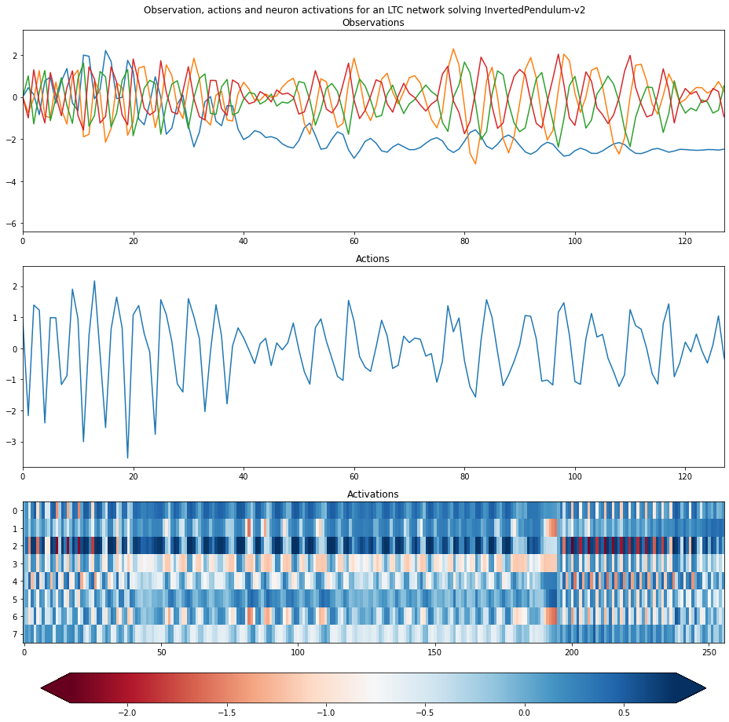

# Continuous Time Neural Networks Policies for Continuous Control (CTNN-Policies)



*Inverted pendulum v1 in mujoco solved by a liquid time-constant network*

This repository contains experiments run in the context of the semester project I worked on at EPFL while under the supervision of Dr. Guillaume Bellegarda, Pr. Auke Ijspeert (both from EPFL's Biorobotics laboratory) and Pr. Wulfram Gerstner (from EPFL's Laboratory of Computational Neurosciences). The goal is to train time-continuous neural networks (more specifically LTCs) for strongly non-linear control tasks (ideally locomotion of quadruped robots) using reinforcement learning. The original code base implementing the adjoint sensitivity method and the training environment from which I forked this repo as well as the DERL package was written by Mikhail Konobeev (https://github.com/MichaelKonobeev).


## Install and Run

Firstly, work in a Python 3.7 environment and install TensorFlow version 1.13.1. Note that GPU version
may not be necessary as the models are quite simple and could run
fast on a powerful CPU. Cloning the repo and installing
the requirements:
```{bash}
git clone --recursive https://github.com/RenardDesNeiges/CTNN_Policies_DERL
cd neuralode-rl
pip install -r requirements.txt
```
You will need to install environment dependencies for
[MuJoCo](https://github.com/openai/mujoco-py)

To run baseline MLP-model experiment on a single env:
```{bash}
python run-mujoco.py --env-id HalfCheetah-v3 --logdir logdir/mlp/half-cheetah.00
```
To run experiments with models containing ode-layers for both
policy and value function:
```{bash}
python run-mujoco.py --env-id HalfCheetah-v3 \
    --logdir logdir/ode/half-cheetah.00 --ode-policy --ode-value
```

## Available environments

All the mujoco gym environments

```
HalfCheetah-v3
Hopper-v3
InvertedDoublePendulum-v2
InvertedPendulum-v2
Reacher-v2
Swimmer-v3
Walker2d-v3
```

## Todo-list

**Done**
* SLURM python wrapper
* Task scheduler for experiments
* Write environment masking/noise preprocessing class
* Energy terms and custom reward
* multi-processing training & logging

**Todo**
* arguments documentation in the readme
* Debug
  * Make the MLP class work with the framework modifications
* Write visualization code to output 
  * Per neuron phase-space plots
  * videos of the experiments
* Run experiments on 
  * more complex gym environments
  * NODE/CT-RNN/LTC convergence
  * NODE/CT-RNN/LTC robustness
  * impact of network topology

## Credits

Mikhail Konobeev's repository from which this repo was forked:
```
@misc{konobeev2018,
  author={Mikhail Konobeev},
  title={Neural Ordinary Differential Equations for Continuous Control},
  year={2019},
  publisher={GitHub},
  journal={GitHub repository},
  howpublished={\url{https://github.com/MichaelKonobeev/neuralode-rl}},
}
```

Mikhail Konobeev's DERL library (https://github.com/MichaelKonobeev/derl)  which I modified starting from the @6fcd44 verison accessible there (https://github.com/MichaelKonobeev/derl/tree/06fcd447ab7ca5d595f29968938f58ad8cd90bee).


Mujoco (https://mujoco.org) and Mujoco-py (https://github.com/openai/mujoco-py) from OpenAI.